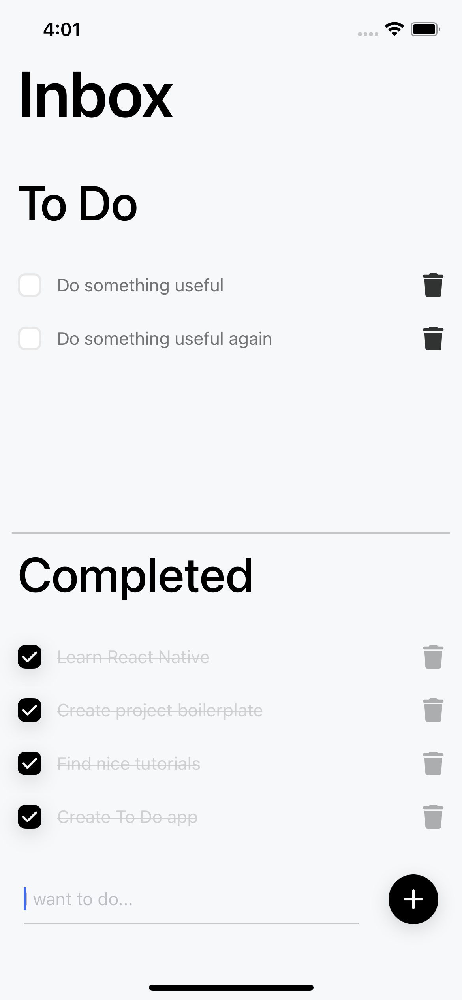

# To Do (React Native)

<p align="center">
  
</p>

## About the Project
React Native To Do application created for learning purposes.

### Built With
- Expo
- React Native
- Redux
- Redux Toolkit
- Redux Persist
- Husky
- Prettier

## Installation and Usage
```
npm install
```

To make the pre-commit hook work, you need to run `npm install` when the project is already initialized as a Git repository.

If the project is initialized as a repository later, you need to additionally execute `npm run prepare`.

```
npm start
```

## Contact
Dmitry Sviridov  
Telegram: [slamach](https://t.me/slamach)  
Email: sviridov.dvv@gmail.com
